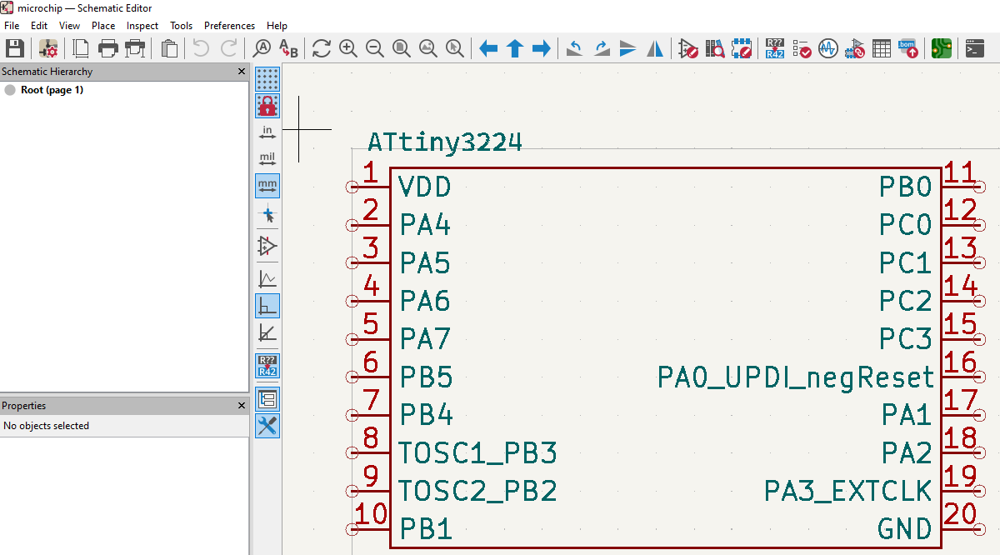

# KiProject
KiCAD Project Generator Script  
This project takes csv file and converts to KiCAD project.  
It will take information from csv file; generate symbol and global labels in a KiCAD project.  
It can be also used for just generating KiCAD libraries.  
  
  
Figure 1. Simple Generated KiCAD Project example. [Click to see this example](./examples/microchip.csv)
  
  
Figure 2. Showcase Generated KiCAD Project's Plot. [Click to see this example](./examples/showcase.py)
  
## Setup

### Windows
1. [Download git bash for windows](https://git-scm.com/downloads/win)
2. Follow instructions at GNU/Linux heading

### GNU/Linux  
Open terminal follow below instructions:  
```bash
$ git clone https://github.com/aslansq/KiProject.git
$ cd KiProject
$ ./configure.sh # it will test your environment and suggest solution
# after configure successful, you can continue with examples
$ ./examples/gen.sh
```
  
## Interface
There are two ways to interface with KiProject.  
  
### [kicli](./doc/kicli.md)

### [kiapi](./doc/kiapi.md)

[comment]: <> (SEO optimizations)
[comment]: <> (generate KiCAD symbols from csv)
[comment]: <> (generate symbols csv)
[comment]: <> (generate KiCAD project from csv)
[comment]: <> (generate KiCAD library from csv)
[comment]: <> (generate KiCAD libraries from csv)


