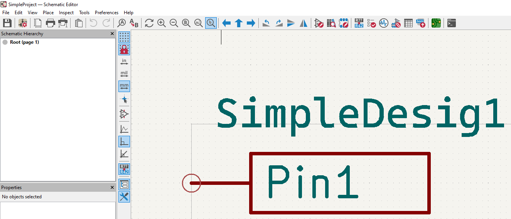

# kiapi module 
```python
class KiApiItem: # fill below structure elements
        def __init__(self):
                self.lib       = "" # library name
                self.sym       = "" # symbol name
                self.desig     = "" # designator name
                self.pin       = "" # pin name
                self.pinNumber = ""
                self.pinPos    = "" # KiConst.availPinPoss
                self.pinType   = "" # KiConst.availPinTypes
                self.pinStyle  = "" # KiConst.availPinStyles

        """
        Use this function to add a node

        Parameters
        ----------
        nodeName (str) : name of the node

        Returns
        -------
        (void)

        """
        def addNode(self, nodeName):

class KiApiItemCont: # fill below structure element
        def __init__(self):
            self.name = None # name of the project

        """
        Use this function to add a item

        Parameters
        ----------
        apiItem (KiApiItem) : item

        Returns
        -------
        (void)

        """
        def add(self, apiItem):

class KiApi:
        def __init__(self,
                csvFilePath=None, #  apiItemCont and csvFilePath is mutually exclusive.
                apiItemCont=None, # type KiApiItemCont
                logFolderPath=None, # mandatory
                outFolderPath=None, # mandatory
                showPinNumbers=False): # show pin numbers of symbol

        """
        Generate KiCAD library

        Parameters
        ----------
        (void)

        Returns
        -------
        Generated file paths (Path)

        """
        def genLib(self):

        """
        Generate KiCAD project

        Parameters
        ----------
        pageHeight (int) : Height of border of the page in KiCAD schematic editor
        pageWidth  (int) : Width of border of the page in KiCAD schematic editor

        Returns
        -------
        Generated file paths (Path)

        """
        def genPrj(self, pageHeight, pageWidth):
```


# Example  
```python
from kiapi import KiApiItem, KiApi, KiApiItemCont

apiItemCont = KiApiItemCont()
apiItemCont.name = "SimpleProject"

apiItem = KiApiItem()
apiItem.lib = "SimpleLib"
apiItem.sym = "SimpleSym1"
apiItem.desig = "SimpleDesig1"
apiItem.pin = "Pin1"
apiItem.pinNumber = "1"
apiItem.pinPos = "left"
apiItem.pinType = "bidirectional"
apiItem.pinStyle = "line"

apiItemCont.add(apiItem)

g_kiApi = KiApi(
        apiItemCont=apiItemCont,
        logFolderPath="log",
        outFolderPath="out/simple",
        showPinNumbers=False
)

genPaths = g_kiApi.genPrj(216,384)

# print generated files
for g in genPaths:
        print("Gen: " + str(g))
```  
  
Figure 1. Expected result of given example