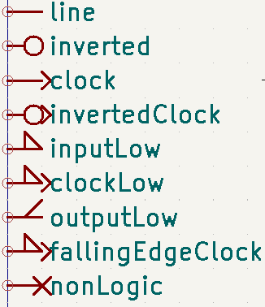
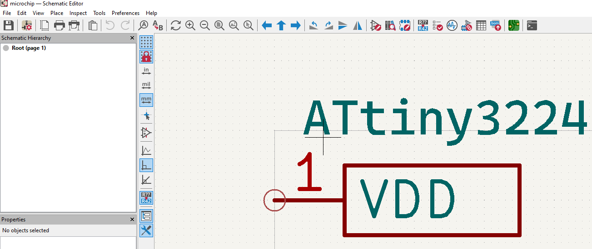

```bash
$ kicli --help
Available options
 --help          , -h : Displays this help
 --pinNumbers    , -p : Optional. Show pin numbers if this parameter is passed.
 --justLib       , -j : Optional. Generate just library if this parameter is passed. Otherwise full project
 --logFolderPath , -l : Mandatory. Where log files are going to be stored.
 --csvFilePath   , -c : Mandatory. Csv file path
 --outFolderPath , -o : Mandatory. Where generated output files are going to be stored.
 --pageHeight    , -h : Optional. Default -> 768 
 --pageWidth     , -w : Optional. Default -> 1366 

Pin Styles
    line
    clock
    clock_low
    edge_clock_high
    input_low
    inverted
    inverted_clock
    non_logic
    output_low

Pin Types
    bidirectional
    input
    output

Pin Positions
    left
    right

Example command:
kicli \
--csvFilePath microchip.csv \
--outFolderPath microchip \
--logFolderPath log \
--pageWidth 384 \
--pageHeight 216 \
--pinNumbers

Content of microchip.csv:
#Library  ,Symbol    ,SymbolDesignator,PinName,PinNumber,PinPos,PinType,PinStyle,GlobalLabels
ATtiny1627,ATtiny3224,ATtiny3224      ,VDD    ,1        ,left  ,input  ,line    ,            
```  
  
Figure 1. Avaliable pin styles  
  
Figure 2. Expected result of help documentation example.
